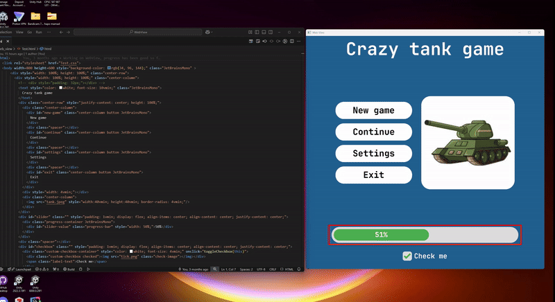

# WebView

**A lightweight HTML/CSS renderer using Vulkan and C++.**



WebView is an experimental project that renders HTML and CSS content using the [Litehtml](https://github.com/litehtml/litehtml) parsing library and Vulkan for GPU-accelerated rendering. 
The goal is to build a lightweight, efficient solution for displaying web content without the complexity of full browser engines like WebKit or Blink.
This project can be used as a robust and easy to use user-interface system for video games.

> **Disclaimer**: This project is still under active development and is not production-ready.

---

## ✨ Features

- **HTML and CSS Parsing**: Powered by Litehtml.
- **High-Performance Rendering**: Built on top of Vulkan.
- **Lightweight Architecture**: Minimal dependencies and modular C++ code.
- **Extendable Design**: Easy to add support for new web standards.

---

## 📂 Project Structure

- `engine/` — Core rendering engine and Vulkan abstractions.
- `executables/web_view/` — Sample application that demonstrates WebView.
- `shared/` — Common utilities and shared components.
- `assets/` — Fonts, images, and other media assets.
- `submodules/` — External dependencies (e.g., Litehtml).

---

## 🛠️ Build Instructions

First, ensure you have installed the Vulkan SDK and CMake (version 3.10+).

1. Clone the repository with submodules:
   ```bash
   git clone --recurse-submodules https://github.com/MohammadFakhreddin/WebView.git

2. Create a build directory:
   ```bash
   mkdir build
   cd build
3. Configure the project with CMake:
   ```bash
   cmake ..
4. Build the project:
   ```bash
   cmake --build .